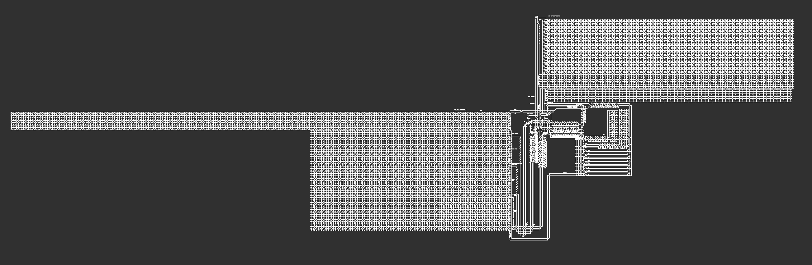
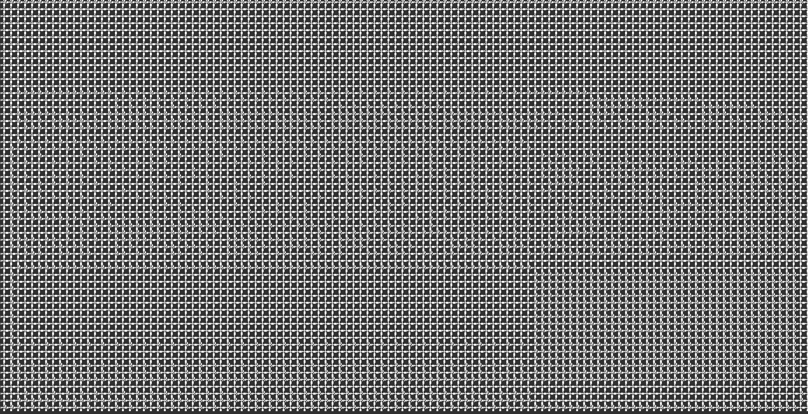
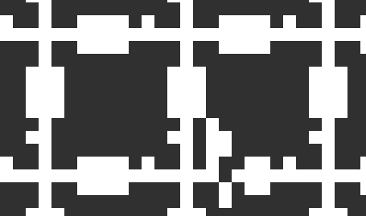
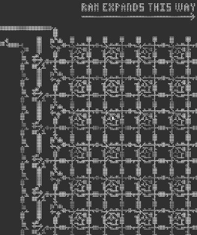

Solves: 72

Points: 115

Solution: We're provided a file, that after some googling, is a input file for the GOLLY Game of Life (GoL) engine. Particularly,
the file contains a modified version of the [Quest for Tetris](https://github.com/QuestForTetris/QFT) computer. While
the original Quest computer implemented Tetris, the one we're provided has a modified ROM, and thus, runs something
different.

Each 'cell' in the comptuter is an [OTCA metapixel](https://www.conwaylife.com/wiki/OTCA_metapixel), which itself is
made up of a 2048x2048 box of individual GoL cells. We looked for something to convert from the many GoL cells into 
individual OTCA metapixels, but was not able to find something already written.

Thus, I decided to process a screen capture of the ROM to get the values out of it. 

ROM only screen grap

Zoomed closer: On the left is a 0, on the right a 1

A key realization is that each one block as a gap in the bottom wire. The script [pngToRom.py](./pngToRom.py) takes 
the image of the whole rom, finds all horizontal and vertical white lines, and uses those to iterate over the segement
at the bottom of each cell. If the line is solid, the cell above is a '0', else it's a '1'.

From there, I got a matrix of individual bits, that was 58 x 114 in shape. Looking at the previously linked github to QFT,
a single instruction is encoded as 58 bits, so the matrix needs to be transposed in shape.

Using the QFT as a reference, I wrote [disassembler.py](disassembler.py), using their example as a test case. In short,
each instruction is encoded right to left, as 4 bits encoding the operation, and then 3 arguments, each with a 2 bit 
addressing mode.

This got me the instructions in [dissambled_prog.txt](dissambled_prog.txt). Putting them in an 
[online inpreter](http://play.starmaninnovations.com/qftasm/) allowed my teammate and I to actually run it. At the end
of the program, a number of values are written to memory, but they do not convert well to ascii, and thus aren't the
flag. We noticed the program read from the memory at address 1, but never wrote there. Thus, we needed to figure out
what value there results in the flag.

Looking at the RAM at the start, some of the OTCA metapixels are in the 'ON' State. Note the two solid white cells,
which indicate the bit is 'On'

However, either way to read that value, and run the program does not result in a flag either.

Since the value is only 16 bits and we have a working interpreter, that value can just be brute forced. A couple lines
of Javascript in my browser later, I started getting flag candidates, and at ~23, I got a flag.

OOO{in_this_life___youre_on_your_own}